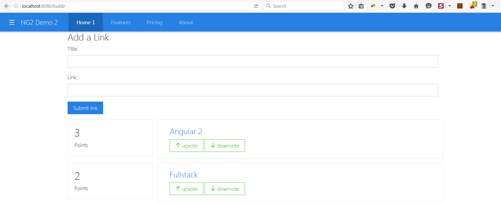

# Angular 2 Quick Starter 



- updated to rc1

```
Angular 2
Bootstrap 4
Custom Theming in place
Gulp
Sass
System JS
Typescript
```

## Start Application

```
gulp
http://localhost:8080/build/
```

**Note**

All development changes should be done inside `public` folder 
